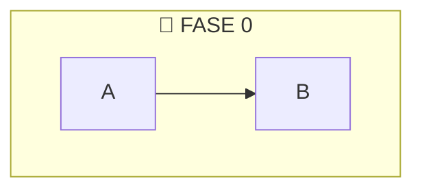
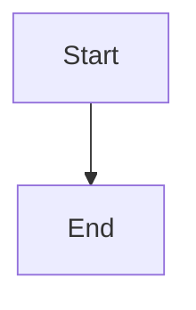
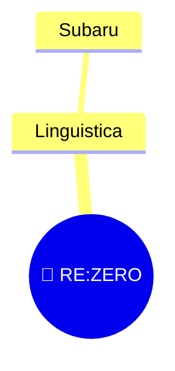
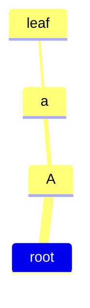

# Universal Mermaid to Obsidian Canvas Semantic Compiler

Compila diagramas Mermaid para workspaces espaciais `.canvas` compatíveis com Obsidian Canvas, preservando hierarquia, agrupamentos e estrutura conceitual quando o diagrama fornece essa semântica.

## Apoie o Projeto

Se este projeto foi útil para você, considere apoiar o desenvolvimento do framework.

<div align="center">

<a href="https://livepix.gg/leo1pardo" target="_blank">


</a>

<br>

[💜 Apoiar via LivePIX](https://livepix.gg/leo1pardo)

</div>


O projeto agora funciona como um compilador espacial universal:

```txt
Any Mermaid Diagram
↓
Diagram Adapter
↓
Semantic Graph IR
↓
Relationship Resolver
↓
Spatial Layout Engine
↓
Obsidian Canvas
```

## Suporte Atual

Diagramas Mermaid suportados:

- `flowchart`
- `graph`
- `mindmap`

Semântica Mermaid suportada:

- nodes
- edges
- chained edges
- `subgraph` como Canvas `type: "group"`
- nested subgraphs como nested semantic groups
- labels com `<br>` convertidos para quebra de linha
- relações `group → group`, `node → group` e `group → node` via conectores virtuais
- mindmap como hierarquia semântica, com internos virando groups e folhas virando nodes

Modos de exportacao:

- `text`: nodes simples de texto
- `file`: nodes de arquivo, sem criar `.md`

## Regra Importante

O compilador gera apenas o arquivo `.canvas`.

Ele nao cria arquivos Markdown automaticamente. No modo `file`, o Canvas apenas referencia arquivos como:

```json
{
  "type": "file",
  "file": "Node.md"
}
```

Isso preserva o workflow nativo do Obsidian: o usuario pode criar o arquivo manualmente pelo proprio Canvas usando o botao "Create File".

## Subgraphs Como Groups

Mermaid:



Canvas:

```json
{
  "type": "group",
  "label": "📜 FASE 0"
}
```

O grupo e exportado antes dos nodes comuns e recebe bounds automaticos calculados a partir dos filhos.

Quando o Mermaid liga grupos semanticamente:

```
F0 --> F1
```

o compilador cria uma edge visual usando conectores virtuais mínimos nos centroides dos groups. Isso preserva o fluxo entre containers mesmo sem edges nativas de group no Obsidian Canvas.

## Entrada

Arquivos aceitos:

- `.mmd`
- `.mermaid`
- `.md`

Para `.md`, existem dois formatos aceitos.

Markdown com bloco Mermaid:

````markdown
# Documento


````

Ou Mermaid puro dentro de um `.md`:



## Saida

O `.canvas` e salvo automaticamente na mesma pasta do input.

```txt
input.md
↓
input.canvas
```

## Instalar

```bash
npm install
```

## Usar

Modo interativo:

```bash
node src/index.js
```

O CLI pergunta:

```txt
Digite o caminho do arquivo Mermaid:
Escolha o modo de exportacao:
```

Modo direto:

```bash
node src/index.js input.md text
node src/index.js input.md file
```

Exemplo:

```bash
npm run example
```

## Scripts

```bash
npm run build
npm test
npm run example
```

- `npm run build`: valida a sintaxe do entrypoint.
- `npm test`: roda os testes do pipeline.
- `npm run example`: gera o Canvas de exemplo em modo `file`.

## Pipeline

```txt
Input
↓
Diagram Type Detection
↓
Parser Router
├── Flowchart Parser
├── Mindmap Parser
└── Future Parsers
↓
Unified Graph IR
├── nodes
├── edges
├── groups
└── hierarchy
↓
Relationship Resolver
↓
Layout Router
├── Flowchart Layout
├── Mindmap Layout
├── Group Layout
└── Future Layouts
↓
Canvas Exporter
├── Text Mode
└── File Mode
```

## Mindmap Hierarchy-First

Mindmap nao e tratado como grafo simples.

```txt
Mindmap Source
↓
Hierarchy Parser
↓
Semantic Tree IR
↓
Measure Pass
↓
Recursive Layout Pass
↓
Canvas Group Export
```

Regra de classificação:

- item com children vira `group`
- item sem children vira leaf node (`file` ou `text`, conforme o modo de exportacao)

Exemplo:



vira uma composição espacial com `root`, `A` e `a` como groups aninhados, e `leaf` como node.

## Arquitetura

```txt
src/
├── parsers/
│   ├── flowchart/
│   │   └── flowchartParser.js
│   ├── mindmap/
│   │   ├── hierarchyBuilder.js
│   │   ├── indentationParser.js
│   │   ├── mindmapParser.js
│   │   └── semanticClassifier.js
│   └── parserRouter.js
├── parser/
│   ├── inputLoader.js
│   ├── markdownMermaid.js
│   └── mermaidParser.js
├── layout/
│   ├── dagreLayout.js
│   ├── flowchartLayout.js
│   ├── groupLayout.js
│   ├── mindmap/
│   │   ├── layoutPass.js
│   │   └── measurePass.js
│   ├── mindmapLayout.js
│   └── layoutRouter.js
├── exporter/
│   ├── exportModes.js
│   └── obsidianCanvas.js
├── cli/
│   └── prompts.js
├── graph/
│   ├── edgeFactory.js
│   ├── groupFactory.js
│   ├── groupRelationshipBuilder.js
│   ├── graphIR.js
│   ├── hierarchyResolver.js
│   ├── nodeFactory.js
│   └── relationshipResolver.js
├── tree/
│   ├── hierarchyResolver.js
│   ├── subtreeMetrics.js
│   ├── treeIR.js
│   └── treeNodeFactory.js
└── index.js
```

## API

```js
import {
  compileWorkspace,
  detectDiagramType,
  parseMermaid,
  applyLayoutForGraph,
  resolveRelationships,
  exportToObsidianCanvas
} from './src/index.js';

await compileWorkspace({
  inputPath: 'input.md',
  exportMode: 'file'
});

const type = detectDiagramType(mermaidText);
const graph = resolveRelationships(parseMermaid(mermaidText));
const positionedGraph = applyLayoutForGraph(graph);
const canvas = exportToObsidianCanvas(positionedGraph, { mode: 'text' });
```

## Graph IR

Todos os diagramas viram uma estrutura semântica unificada.

```js
{
  diagramType: 'flowchart',
  direction: 'LR',
  nodes: [
    {
      id: 'A',
      text: 'Node',
      parentGroup: 'F0'
    }
  ],
  edges: [
    {
      from: 'A',
      to: 'B'
    }
  ],
  groups: [
    {
      id: 'F0',
      label: '📜 FASE 0',
      children: {
        nodes: ['A', 'B'],
        groups: []
      },
      bounds: {
        x: 0,
        y: 0,
        width: 500,
        height: 300
      }
    }
  ],
  semanticEdges: [
    {
      from: { type: 'group', id: 'F0', groupId: 'F0' },
      to: { type: 'group', id: 'F1', groupId: 'F1' }
    }
  ],
  metadata: {
    diagramType: 'flowchart'
  }
}
```

## Limites Atuais

Ainda nao suportado:

- `sequenceDiagram`
- `journey`
- `stateDiagram`
- `gitGraph`
- `gantt`
- subgraphs avancados
- styles/classes Mermaid
- multiplos blocos Mermaid em um mesmo Markdown

## Specs

Mudancas e decisoes do projeto devem ser documentadas em [specs/](specs/).

- [doc/specs/001-current-mvp.md](doc/specs/001-current-mvp.md)
- [doc/specs/002-knowledge-workspace-generator.md](doc/specs/002-knowledge-workspace-generator.md)
- [doc/specs/003-universal-mermaid-canvas-compiler.md](doc/specs/003-universal-mermaid-canvas-compiler.md)
- [doc/specs/004-semantic-spatial-compiler.md](doc/specs/004-semantic-spatial-compiler.md)
- [doc/specs/005-layout-intelligence-semantic-connectivity.md](doc/specs/005-layout-intelligence-semantic-connectivity.md)
- [doc/specs/006-mindmap-hierarchy-spatial-engine.md](doc/specs/006-mindmap-hierarchy-spatial-engine.md)
