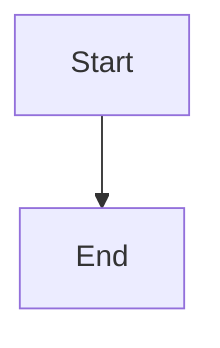

# Spec 001 - MVP Atual

## Objetivo

Converter um arquivo Markdown contendo um bloco Mermaid `flowchart` em um arquivo `.canvas` compativel com Obsidian Canvas.

## Decisao principal

O input oficial do projeto e Markdown (`.md`), nao Mermaid puro (`.mmd`).

Motivo:

- o uso esperado acontece dentro de documentos Markdown
- Obsidian trabalha naturalmente com Markdown
- o Mermaid continua sendo apenas uma sintaxe dentro do documento
- o compilador pode preservar a arquitetura centrada no Graph IR

## Fluxo

```txt
Markdown File
↓
extractMermaidBlock(markdownText)
↓
parseMermaidToGraph(mermaidText)
↓
applyLayout(graph)
↓
exportToObsidianCanvas(positionedGraph)
↓
write output.canvas
```

## Entrada

Arquivo `.md` com pelo menos um bloco fenced `mermaid`.

````markdown

````

No MVP, apenas o primeiro bloco `mermaid` e usado.

## Saida

Arquivo `.canvas` JSON com:

- `nodes`
- `edges`

Cada node e exportado como node de texto do Obsidian Canvas.

## Modulos

- `src/parser/markdownMermaid.js`: extrai o bloco Mermaid do Markdown
- `src/parser/mermaidParser.js`: converte Mermaid flowchart em Graph IR
- `src/graph/graphIR.js`: cria e normaliza o grafo intermediario
- `src/layout/dagreLayout.js`: calcula posicoes com Dagre
- `src/exporter/obsidianCanvas.js`: converte grafo posicionado em JSON Canvas
- `src/index.js`: CLI e exports publicos

## Suporte atual

- `flowchart TD`
- `flowchart LR`
- `graph TD`
- labels simples
- emojis
- conexoes encadeadas
- nos reutilizados

## Fora do MVP

- subgraphs
- styles
- classes
- click events
- animacoes
- themes
- multiplos blocos Mermaid no mesmo Markdown

## Validacao

Comandos usados para validar:

```bash
npm run build
npm test
npm run example
```

## Regra de documentacao

A partir desta spec, toda mudanca relevante de comportamento, arquitetura, CLI, formato de entrada, formato de saida ou dependencia deve ser registrada em `specs/`.
