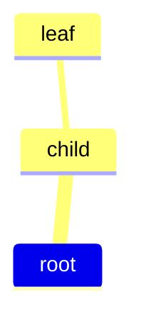

# Spec 003 - Universal Mermaid to Obsidian Canvas Compiler

## Objetivo

Expandir o projeto para suportar multiplos tipos de diagramas Mermaid e tornar o Canvas o unico artefato gerado automaticamente.

## Decisao principal

O sistema nao deve criar arquivos `.md` automaticamente.

Motivo:

- arquivos criados fora do Obsidian nao seguem necessariamente o workflow nativo do Canvas
- nodes `type: "file"` ja oferecem o botao "Create File" dentro do Obsidian
- o Canvas deve funcionar como workspace scaffold, nao como vault generator

## Artefatos gerados

O compilador gera apenas:

```txt
input.canvas
```

No modo `file`, os nodes apenas referenciam:

```json
{
  "type": "file",
  "file": "Node.md"
}
```

Nenhum arquivo `Node.md` e criado pelo compilador.

## Modos de exportacao

### Text mode

```json
{
  "type": "text",
  "text": "Node"
}
```

### File mode

```json
{
  "type": "file",
  "file": "Node.md"
}
```

## Diagram type detection

Interface:

```js
detectDiagramType(text)
```

O detector le a primeira linha relevante e identifica:

- `flowchart`
- `graph`
- `mindmap`
- tipos futuros como `sequenceDiagram`, `journey`, `gantt`

Tipos detectados mas ainda nao implementados geram erro explicito.

## Parser router

Interface:

```js
parseMermaid(text)
```

Fluxo:

```txt
detectDiagramType
↓
switch diagramType
├── flowchart -> parseFlowchart
└── mindmap -> parseMindmap
```

## Mindmap parser

Mindmap nao possui edges explicitas.

O parser:

1. le linhas relevantes
2. calcula indentacao
3. normaliza labels, incluindo `root((label))`
4. usa uma stack hierarquica
5. infere edges parent -> child

Exemplo:



Vira:

```txt
root -> child
child -> leaf
```

## Unified Graph IR

Todos os parsers retornam:

```js
{
  diagramType,
  direction,
  nodes: [
    {
      id,
      text,
      depth,
      metadata
    }
  ],
  edges: [
    {
      from,
      to,
      metadata
    }
  ]
}
```

## Layout router

Interface:

```js
applyLayoutForGraph(graph)
```

Fluxo:

```txt
flowchart -> Dagre layout
mindmap -> tree layout simples
```

## Compatibilidade de input

Arquivos aceitos:

- `.mmd`
- `.mermaid`
- `.md`

Para `.md`:

- se houver bloco fenced `mermaid`, ele e usado
- se nao houver bloco fenced, o conteudo inteiro e tratado como Mermaid bruto quando um tipo valido e detectado

## CLI

Execucao interativa:

```bash
node src/index.js
```

Modo direto:

```bash
node src/index.js input.md text
node src/index.js input.md file
```

## Validacao

Comandos usados:

```bash
npm run build
npm test
npm run example
npm audit
```
